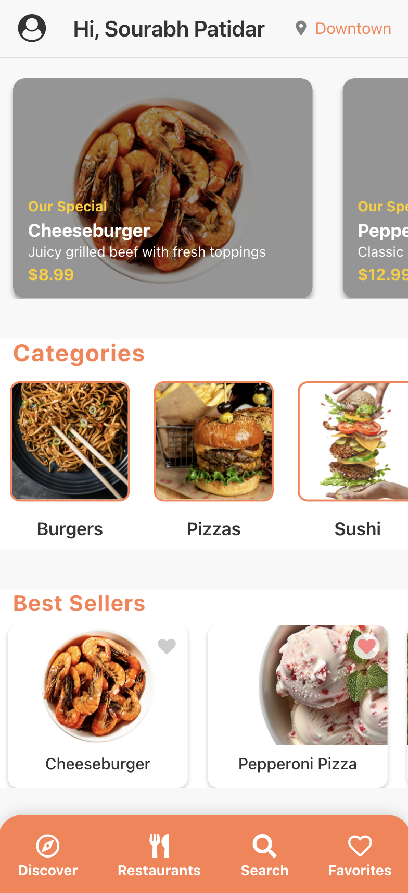
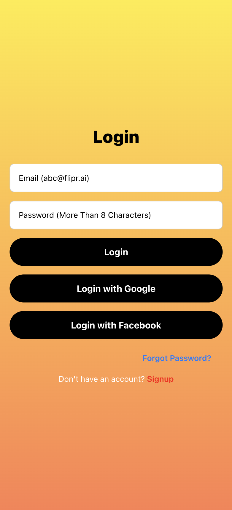
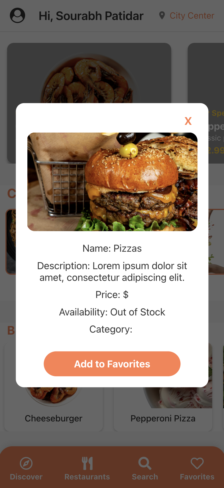
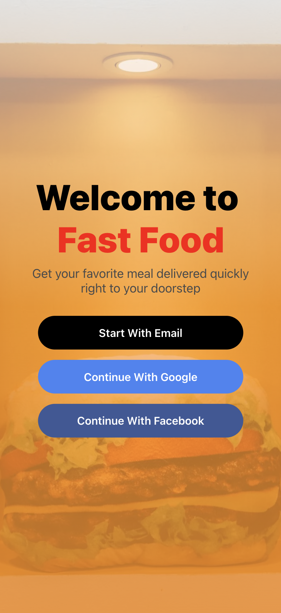
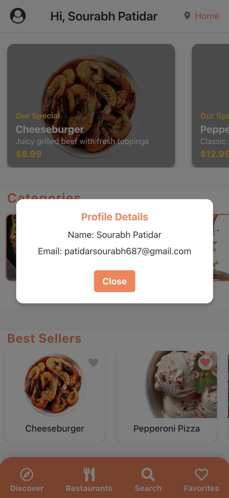
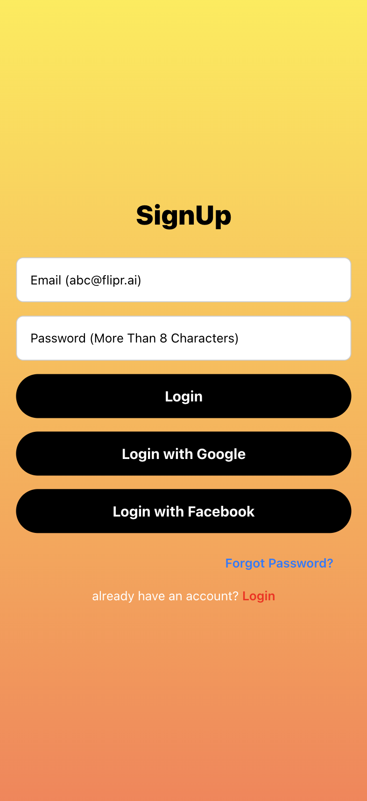

# 🍔 FastFood - React Native Expo App

  <!-- iOS -->
  
  <!-- Android -->
  

## 📱 About FastFood

FastFood is a mobile application built with React Native and Expo, aimed at providing a seamless user experience for food ordering. This app features a welcoming UI, easy navigation, and quick access to various food categories and detailed product pages. 

## 🚀 Getting Started

> `npx create-expo my-app --example with-reanimated`

- Run `yarn` or `npm install`
- Run `yarn start` or `npm run start` to try it out.

## 📝 Notes

- [`react-native-reanimated` docs](https://docs.swmansion.com/react-native-reanimated/)
# FastFood

### 📸 Screenshots

**Homepage**

**Login Page**

**Product Detail Page**

**Welcomepage**

**Contactinfo**

**SignUpPage**

## 🎬 Demo

📝 Additional Notes
-> This project utilizes react-native-reanimated for enhanced animations and smooth transitions.
-> Make sure to set up the environment for Expo on your device by following the Expo setup guide.
